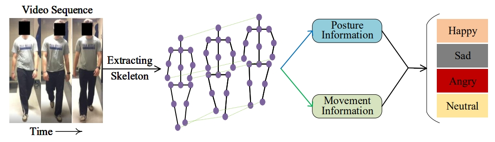
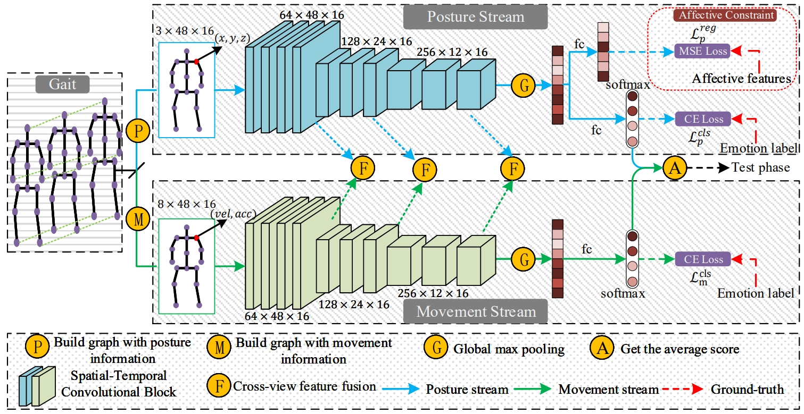

<div align="center">

# Looking into Gait for Perceiving Emotions via Bilateral Posture and Movement Graph Convolutional Networks [TAFFC 2024]


<i>Yingjie Zhai*, Guoli Jia*, Yu-Kun Lai, Jing Zhang, Jufeng Yang, and Dacheng Tao</i>

<a href=" "></a>
[](https://cis.ieee.org/publications/t-neural-networks-and-learning-systems)
[](./LICENSE)

</div>

This is the official implementation of our **TAFFC 2024** paper.  </br>

## Publication

>**Looking into Gait for Perceiving Emotions via Bilateral Posture and Movement Graph Convolutional Networks**<br>
Yingjie Zhai*, Guoli Jia*, Yu-Kun Lai, Jing Zhang, Jufeng Yang, and Dacheng Tao<br>
<i>IEEE Transactions on Affective Computing (TAFFC)</i>.</br>
[[PDF]](https://exped1230.github.io/BPM-GCN/GaitEmotion-BPM-GCN/static/pdfs/TAFFC_BPM_GCN.pdf)
[[Project Page]](https://exped1230.github.io/BPM-GCN/GaitEmotion-BPM-GCN/index.html)</br>




## Abstract

Emotions can be perceived from a person's gait, i.e., their walking style. Existing methods on gait emotion recognition mainly leverage the posture information as input, but ignore the body movement, which contains complementary information for recognizing emotions evoked in the gait. In this paper, we propose a Bilateral Posture and Movement Graph Convolutional Network (BPM-GCN) that consists of two parallel streams, namely posture stream and movement stream, to recognize emotions from two views. The posture stream aims to explicitly analyse the emotional state of the person. Specifically, we design a novel regression constraint based on the hand-engineered features to distill the prior affective knowledge into the network and boost the representation learning. The movement stream is designed to describe the intensity of the emotion, which is an implicitly cue for recognizing emotions. To achieve this goal, we employ a higher-order velocity-acceleration pair to construct graphs, in which the informative movement features are utilized. Besides, we design a PM-Interacted feature fusion mechanism to adaptively integrate the features from the two streams. Therefore, the two streams collaboratively contribute to the performance from two complementary views. Extensive experiments on the largest benchmark dataset Emotion-Gait show that BPM-GCN performs favorably against the state-of-the-art approaches (with at least 4.59% performance improvement).



## Running

You can easily train and evaluate the model by running the script below.


***Installation***: Please clone the repository, prepare enviroment, and compile corresponding packages. 

1. Clone repository
```
git clone https://github.com/exped1230/BPM-GCN.git
```
2. Create an Anaconda environment and install the dependencies

```
conda create --name BPM-GCN
conda activate BPM-GCN
conda install pip
pip install -r requirements.txt
```

***Datasets***: The used datasets are provided in the homepage of [Emotion-Gait](https://gamma.umd.edu/software). 


***Hyperparameter***: You can adjust more details such as epoch, batch size, etc. Please refer to config directory.


***Training***: We prepare the shell to run the training process.

```
python main_diff_combine_double_fagg.py --config ./config EGait_journal/test_diff_combine_double_score_fagg.yaml
```

## Citation
If you find this repo useful in your project or research, please consider citing the relevant publication.

**Bibtex Citation**
````
@article{zhai2024Looking,
  author={Zhai, Yingjie and Jia, Guoli and Lai, Yu-Kun and Zhang, Jing and Yang, Jufeng and Tao, Dacheng}
  journal={IEEE Transactions on Affective Computing}, 
  title={Looking into Gait for Perceiving Emotions via Bilateral Posture and Movement Graph Convolutional Networks}, 
  year={2024}
}

````
